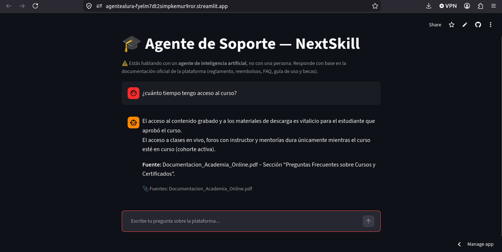

# 🎓 Alura Agente — NextSkill (Academia Online)

Agente de inteligencia artificial que responde preguntas de los estudiantes de **NextSkill** (academia online hipotética) basándose en la documentación oficial de la plataforma: reglamento del estudiante, política de reembolsos, FAQ de cursos y certificados, guía de uso y programa de becas/afiliados.

Construido como desafío final del curso **Alura Agentes**.

🔗 **App en producción:** https://agentealura-fyelm7dt2simpkemur9ror.streamlit.app/

---

## 📐 Arquitectura

El agente sigue el patrón **RAG (Retrieval-Augmented Generation)**:

```
PDF (documentación NextSkill)
        │
        ▼
  Chunking (RecursiveCharacterTextSplitter)
        │
        ▼
  Embeddings (Gemini — gemini-embedding-001)
        │
        ▼
  Base vectorial (Chroma, persistente)
        │
        ▼  (pregunta del usuario → embedding → búsqueda por similitud)
  Recuperación de los 5 fragmentos más relevantes
        │
        ▼
  Prompt (contexto + pregunta) → LLM (Groq — openai/gpt-oss-20b)
        │
        ▼
  Respuesta con cita de la fuente + registro en logs
        │
        ▼
  Interfaz de chat (Streamlit)
```

**Tecnologías:** Python · LangChain · Google Gemini (embeddings) · Groq (generación) · ChromaDB · Streamlit


---

## 💬 Ejemplos de preguntas y respuestas

**P: ¿Cuánto tiempo tengo acceso al contenido del curso después de aprobarlo?**
> El acceso al contenido grabado y a los materiales de descarga es vitalicio para el estudiante que aprobó el curso.
> 📎 Fuente: Documentacion_Academia_Online.pdf

**P: ¿Qué porcentaje me devuelven si pido el reembolso después del día 10 de clases?**
> El reembolso aplica al 50% del valor pagado si solicitas la devolución entre el día 8 y el día 15 de clases.
> 📎 Fuente: Documentacion_Academia_Online.pdf — Sección 2.1 "Plazos y porcentajes de reembolso"

**P: ¿Qué pasa si repruebo el curso, puedo volver a presentarlo?**
> Si repruebas, tienes derecho a una re-entrega de la evaluación final dentro de los 15 días posteriores al cierre del curso. Si después de la re-entrega no alcanzas la nota mínima, puedes re-matricularte en la siguiente cohorte con un 30% de descuento.
> 📎 Fuente: Documentacion_Academia_Online.pdf

**P: ¿Puedo pausar un curso y retomarlo después?**
> Sí. En los cursos asincrónicos puedes pausar y retomarlos sin límite de tiempo. En los Bootcamps con cohorte fija no es posible pausar; el estudiante puede solicitar traslado a la siguiente cohorte según la política de reembolsos.
> 📎 Fuente: Documentacion_Academia_Online.pdf

**P: ¿Cómo puedo unirme al programa de afiliados y cuánta comisión gano?**
> Para unirte al Programa de Afiliados, inicia sesión en tu cuenta y ve a Mi cuenta > Programa de afiliados. La comisión es del 15% sobre cada matrícula generada a través de tu enlace, pagadera mensualmente al superar 50 USD acumulados.
> 📎 Fuente: Documentacion_Academia_Online.pdf — Sección 5.3 "Programa de afiliados"

**P: ¿Cuál es la política de vacaciones para los empleados?**
> No encontré esta información en los documentos disponibles. Para obtener detalles, por favor contacte a soporte@nextskill.academy.
> 📎 Fuente: Documentacion_Academia_Online.pdf

> ✅ Este último ejemplo demuestra que el agente **no alucina**: cuando la documentación no cubre una pregunta, lo indica explícitamente en vez de inventar una respuesta.

---

## ⚙️ Cómo ejecutar el proyecto localmente

```bash
# 1. Clona el repositorio
git clone https://github.com/TU-USUARIO/Agente_Alura.git
cd Agente_Alura

# 2. Crea el entorno virtual
python3 -m venv venv
source venv/bin/activate      # En Windows: venv\Scripts\activate

# 3. Instala las dependencias
pip install -r requirements.txt

# 4. Configura tus API keys
cp .env.example .env
# Edita .env y agrega tu GOOGLE_API_KEY (https://aistudio.google.com/apikey)
# y tu GROQ_API_KEY (https://console.groq.com/keys)

# 5. Genera el índice vectorial a partir del PDF
python src/indexar_documentos.py

# 6. Corre el agente por terminal
python src/agente_rag.py

# 7. O bien, corre la interfaz de chat
streamlit run interfaz_chat.py
```

---

## ☁️ Deploy en la nube

- **Interfaz:** desplegada en [Streamlit Community Cloud](https://agentealura-fyelm7dt2simpkemur9ror.streamlit.app/), conectada directamente a este repositorio de GitHub.
- **Servicio OCI:** el documento fuente (PDF) se almacena en un bucket de **OCI Object Storage** (`nextskill-docs`), cumpliendo el requisito de usar al menos un servicio del ecosistema OCI.

**Capturas:**



---

## 📝 Registro de ejecución

Cada interacción (pregunta, contexto recuperado, respuesta, fuentes y tiempo de respuesta) queda registrada en `logs/interacciones.jsonl`, garantizando trazabilidad y permitiendo auditar el comportamiento del agente.

---

## 📂 Estructura del proyecto

```
Agente_Alura/
├── data/
│   └── Documentacion_Academia_Online.pdf
├── src/
│   ├── indexar_documentos.py    # procesa el PDF y genera el índice vectorial
│   ├── agente_rag.py             # recupera contexto y genera la respuesta
│   └── registro_ejecucion.py     # registra cada interacción
├── interfaz_chat.py              # interfaz de chat (Streamlit)
├── requirements.txt
├── .env.example
└── docs/screenshots/             # evidencia del deploy
```

---

## 🙋 Sobre el proyecto

Desarrollado como desafío final del programa **Alura Agentes**, aplicando conceptos de RAG (Retrieval-Augmented Generation): procesamiento de documentos, indexación vectorial, recuperación semántica y generación de respuestas con LLM.